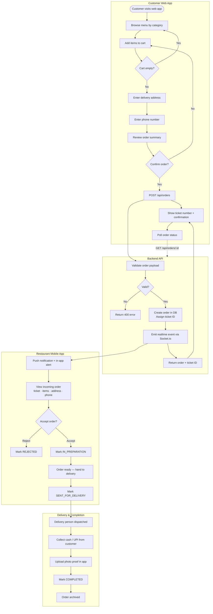
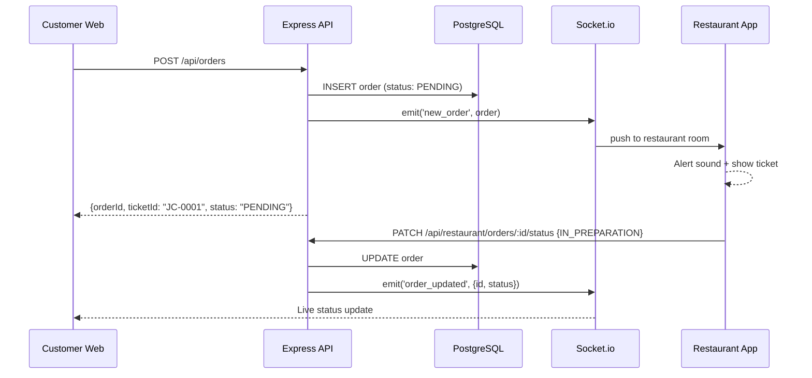
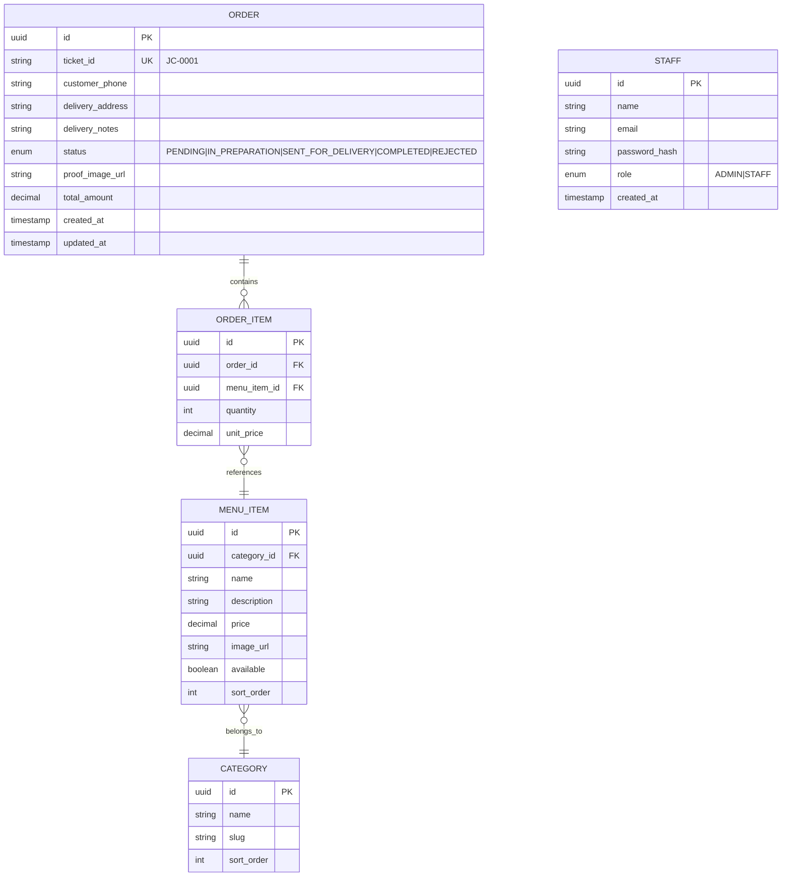

# Juice Stop — Restaurant Ordering & Delivery Platform

A full-stack, cloud-deployed ordering system for a college residency juice shop. Replaces manual phone-based ordering with a seamless digital pipeline: customer web app + restaurant mobile app, connected in real-time.

---

## Problem Statement

- Manual phone ordering → busy lines → rejected orders → 30+ min delays
- No visibility into order status for customers or staff
- No structured delivery workflow or payment verification

## Solution

| Layer | What it does |
|-------|-------------|
| Customer Web App | Browse menu, place order, get ticket number, track status |
| Restaurant Mobile App | Receive real-time order alerts, manage order lifecycle, upload payment proof |
| Cloud Backend | REST API + WebSocket server, PostgreSQL, Redis, Blob storage |

---

## System Architecture

### Component Diagram

```
┌─────────────────────────────────────────────────────────────┐
│                        CLIENT LAYER                         │
│                                                             │
│   Customer Web App (Next.js)    Restaurant App (Expo RN)   │
│         [Vercel]                      [Expo EAS]           │
└────────────────┬──────────────────────────┬────────────────┘
                 │ HTTPS                    │ HTTPS + WSS
┌────────────────▼──────────────────────────▼────────────────┐
│                         API LAYER                           │
│                                                             │
│         Express.js REST API + Socket.io                     │
│                    [Railway]                                │
└──────┬───────────────────┬──────────────────┬──────────────┘
       │                   │                  │
┌──────▼──────┐   ┌────────▼──────┐   ┌──────▼──────┐
│ PostgreSQL  │   │  Redis Cache  │   │ Vercel Blob │
│   (Neon)   │   │  (Upstash)    │   │ Photo Proof │
└─────────────┘   └───────────────┘   └─────────────┘
```

### System Workflow



### Real-Time Sequence



---

## Tech Stack

### Frontend — Customer Web App

| Technology | Role | Justification |
|-----------|------|--------------|
| **Next.js 15** (App Router) | Framework | SSR for fast menu load, Vercel-native, file-based routing |
| **Tailwind CSS** | Styling | Utility-first, mobile-first, fast iteration |
| **shadcn/ui** | Component library | Accessible, composable, no lock-in |
| **Zustand** | Cart state | Lightweight, no boilerplate, persists to localStorage |
| **TanStack Query** | Data fetching | Polling, caching, retry logic for order status |
| **Socket.io client** | Real-time | Order status pushed from server |

### Restaurant Mobile App

| Technology | Role | Justification |
|-----------|------|--------------|
| **Expo (React Native)** | Framework | Cross-platform, OTA updates, no app store wait |
| **Expo Push + FCM** | Notifications | Foreground + background order alerts |
| **expo-image-picker** | Photo capture | UPI proof photo upload |
| **Zustand** | State | Same mental model as web app |
| **Socket.io client** | Real-time | Shared server, instant order push |

### Backend

| Technology | Role | Justification |
|-----------|------|--------------|
| **Node.js + Express.js** | API server | Fast to build, large ecosystem |
| **Socket.io** | WebSocket server | Rooms per session, HTTP fallback |
| **Prisma** | ORM | Type-safe, migration-based, great PostgreSQL support |
| **JWT + bcrypt** | Auth | Stateless, secure staff login |
| **Multer** | File uploads | Photo proof handling before blob storage |
| **express-rate-limit** | Rate limiting | Prevent order spam |

### Data & Infrastructure

| Service | Product | Role |
|---------|---------|------|
| Primary DB | **Neon PostgreSQL** | Orders, menu, staff — free tier, serverless |
| Cache | **Upstash Redis** | Rate limiting, ticket counter, session store |
| File storage | **Vercel Blob** | Payment proof photos |
| Web hosting | **Vercel** | Customer web app + CI/CD from GitHub |
| API hosting | **Railway** | Express + Socket.io (persistent connections) |
| Mobile CI | **Expo EAS** | Build + OTA updates |

---

## Data Models



---

## API Endpoints

### Public (Customer)

| Method | Endpoint | Description |
|--------|----------|-------------|
| `GET` | `/api/menu` | Full menu with categories and items |
| `GET` | `/api/menu/categories` | Category list only |
| `POST` | `/api/orders` | Create a new order |
| `GET` | `/api/orders/:id` | Get order by UUID |
| `GET` | `/api/orders/ticket/:ticketId` | Get order by ticket ID |

### Authenticated (Restaurant Staff)

| Method | Endpoint | Description |
|--------|----------|-------------|
| `POST` | `/api/auth/login` | Staff login → JWT |
| `POST` | `/api/auth/refresh` | Refresh access token |
| `POST` | `/api/auth/logout` | Invalidate refresh token |
| `GET` | `/api/restaurant/orders` | List orders (filter by status) |
| `PATCH` | `/api/restaurant/orders/:id/status` | Update order status |
| `POST` | `/api/restaurant/orders/:id/proof` | Upload payment proof photo |
| `PATCH` | `/api/menu/items/:id/availability` | Toggle item availability |

### Order Status Flow

```
PENDING → IN_PREPARATION → SENT_FOR_DELIVERY → COMPLETED
       ↘                                      ↗
         REJECTED (can happen from PENDING only)
```

---

## Security

| Concern | Mitigation |
|---------|-----------|
| Phone number privacy | Never logged server-side; not returned in list endpoints |
| Address privacy | HTTPS only; not indexed or searchable |
| Order spoofing | Phone format validated; rate limited 5 orders/hour per IP |
| Staff auth | JWT 8hr expiry + refresh token rotation stored in Redis |
| Photo uploads | MIME type validated server-side; max 5MB; stored as private blob |
| SQL injection | Prisma parameterized queries — zero raw SQL |
| CORS | Strict origin whitelist (web domain + mobile deep link) |

---

## Monorepo Structure

```
juice-stop/
├── apps/
│   ├── web/                  # Next.js 15 — Customer web app
│   │   ├── app/
│   │   │   ├── page.tsx      # Menu + landing
│   │   │   ├── order/
│   │   │   │   ├── page.tsx  # Checkout form
│   │   │   │   └── [id]/
│   │   │   │       └── page.tsx  # Order status
│   │   │   └── layout.tsx
│   │   ├── components/
│   │   ├── lib/
│   │   └── package.json
│   │
│   └── mobile/               # Expo — Restaurant mobile app
│       ├── app/
│       │   ├── (auth)/
│       │   ├── orders/
│       │   └── _layout.tsx
│       └── package.json
│
├── packages/
│   ├── api/                  # Express + Socket.io server
│   │   ├── src/
│   │   │   ├── routes/
│   │   │   ├── middleware/
│   │   │   ├── sockets/
│   │   │   └── index.ts
│   │   └── package.json
│   │
│   ├── db/                   # Prisma schema + migrations
│   │   ├── prisma/
│   │   │   └── schema.prisma
│   │   ├── src/
│   │   │   └── index.ts      # Prisma client export
│   │   └── package.json
│   │
│   └── shared/               # Shared types + validators
│       ├── src/
│       │   ├── types.ts
│       │   └── validators.ts
│       └── package.json
│
├── turbo.json
├── package.json              # Workspace root
├── CLAUDE.md
└── README.md
```

---

## Cloud Deployment

| Service | Platform | URL |
|---------|---------|-----|
| Customer Web App | Vercel | `juicestop.vercel.app` |
| API + WebSocket | Railway | `api.juicestop.up.railway.app` |
| Database | Neon PostgreSQL | (connection string via env) |
| Cache | Upstash Redis | (connection string via env) |
| File storage | Vercel Blob | (token via env) |
| Mobile App | Expo EAS | Distributed via QR / EAS link |

All services communicate over the public internet via HTTPS/WSS. No local networking required.

---

## Environment Variables

### apps/web (.env)
```
NEXT_PUBLIC_API_URL=https://api.juicestop.up.railway.app
NEXT_PUBLIC_SOCKET_URL=https://api.juicestop.up.railway.app
```

### packages/api (.env)
```
DATABASE_URL=postgresql://...@neon.tech/juicestop
REDIS_URL=rediss://...@upstash.io:6380
JWT_SECRET=...
JWT_REFRESH_SECRET=...
BLOB_READ_WRITE_TOKEN=...
CORS_ORIGINS=https://juicestop.vercel.app
```

---

## Ticket ID System

Ticket IDs are human-readable sequential numbers backed by a Redis atomic counter:

```
JC-0001, JC-0002, JC-0003, ...
```

Redis `INCR ticket:seq` ensures no two orders ever share a ticket number, even under concurrent load.

---

## Development Timeline

| Week | Milestone |
|------|-----------|
| 1–2 | Backend: Prisma schema, Express setup, auth, menu CRUD |
| 3 | Customer Web App: menu, cart, order form, confirmation |
| 4 | Restaurant Mobile App: order list, status management, Socket.io |
| 5 | Integration: real-time wiring, push notifications, status polling |
| 6 | Photo proof upload + completion flow |
| 7 | Testing + cloud deployment (Vercel, Railway, EAS) |
| 8 | Soft launch, monitoring, bug fixes |

---

## MVP vs. Enhancements

### MVP
- Menu browsing + cart + order placement
- Restaurant order inbox (incoming / in-prep / dispatched / done)
- Ticket ID system (JC-XXXX)
- Photo upload for payment proof
- Real-time push to restaurant app
- Staff login

### Phase 2
- Customer live order status tracking
- Order history lookup by phone number
- Menu availability toggle (sold out)
- Daily revenue summary report
- SMS confirmation (Twilio / MSG91)

### Phase 3
- Analytics dashboard (peak hours, popular items)
- Delivery person assignment + GPS tracking
- Repeat order shortcut
- Scheduled pre-orders

---

## Contributing

This is a private project for Juice Stop residency operations. Contact the project owner for access.
